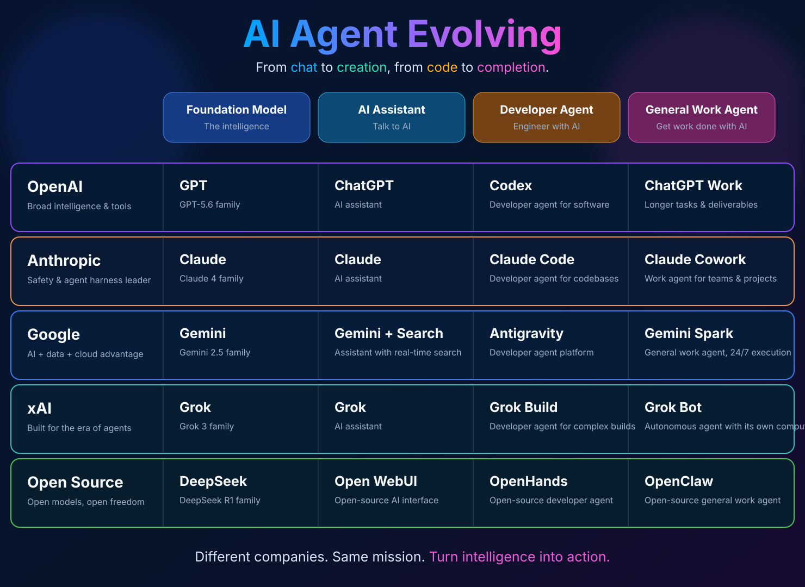

# Awesome AI Agent Landscape

A living map of how the major AI ecosystems evolve:

> **Foundation Model → AI Assistant → Developer Agent → General Work Agent**

  

The industry is not simply releasing better chatbots. Each major ecosystem is extending the same arc: first intelligence, then conversation, then agents that can build, and finally agents that can own longer-running work.

This repository tracks that evolution in one comparable map. It is a **product-positioning landscape**, not a generic directory of agent frameworks.

## The map

| Ecosystem | Foundation Model The intelligence | AI Assistant Talk to AI | Developer Agent Engineer with AI | General Work Agent Get work done with AI |
|---|---|---|---|---|
| **OpenAI** Broad general intelligence & leading developer tools | [GPT](https://openai.com/)  GPT-5.6 family | [ChatGPT](https://chatgpt.com/)  AI assistant | [Codex](https://openai.com/codex/)  Developer agent for software | [ChatGPT Work](https://chatgpt.com/)  Longer tasks & deliverables |
| **Anthropic** AI safety pioneers & agent-harness leaders | [Claude](https://www.anthropic.com/claude)  Claude 4 family | [Claude](https://claude.ai/)  AI assistant | [Claude Code](https://docs.anthropic.com/en/docs/claude-code/overview)  Developer agent for codebases | [Claude Cowork](https://claude.ai/)  General work agent for teams & projects |
| **Google** AI + data + cloud advantage | [Gemini](https://gemini.google.com/)  Gemini 2.5 family | [Gemini + Search](https://gemini.google.com/)  Assistant with real-time search | Antigravity  Developer agent platform | Gemini Spark  General work agent, 24/7 execution |
| **xAI** Built for the era of agents | [Grok](https://grok.com/)  Grok 3 family | [Grok](https://grok.com/)  AI assistant | Grok Build  Developer agent for complex builds | Grok Bot  Autonomous agent with its own computer |
| **Open Source** Open models, open freedom | [DeepSeek](https://github.com/deepseek-ai/DeepSeek-R1)  DeepSeek R1 family | [Open WebUI](https://github.com/open-webui/open-webui)  Open-source AI interface | [OpenHands](https://github.com/All-Hands-AI/OpenHands)  Open-source developer agent | [OpenClaw](https://github.com/openclaw/openclaw)  Open-source general work agent |

## What this repository tracks

Each cell is a maintained product record in [data/landscape.yml](data/landscape.yml), with:

- the ecosystem and stage in the evolution;
- the named product or product family;
- a primary source, when one is available;
- current status: **active**, **tracking**, **renamed**, **retired**, or **unverified**;
- a short note explaining why it occupies that position.

A blank or unverified entry is useful information: it means the market has not yet produced a clear public product for that role, or its status is still being validated. We will not fill gaps merely to make the grid look complete.

## How to read the stages

| Stage | It mainly does | Typical user relationship |
|---|---|---|
| **Foundation Model** | Provides reasoning, language, vision, code, and other raw intelligence | You or an application call the model |
| **AI Assistant** | Responds interactively and helps with individual tasks | You drive the conversation |
| **Developer Agent** | Reads codebases, uses tools, makes changes, and verifies work | You delegate engineering tasks |
| **General Work Agent** | Runs longer tasks across files, apps, research, and deliverables | You assign an outcome and supervise |

These are product roles, not strict technical boundaries. A strong assistant can use tools; a developer agent is also an assistant. The useful question is **what job the product is designed to own**.

## Update policy

We update the map when a major ecosystem makes a meaningful move across one of the four stages:

- a new model family materially changes the foundation;
- an assistant gains persistent tools, memory, or real-time grounding;
- a coding product becomes an autonomous developer agent;
- a product can carry out longer-running, cross-application work with meaningful autonomy;
- an entry is renamed, discontinued, or its public availability changes.

The aim is to capture the strategic shift, not every feature launch.

## Contributing

If you spot a change, open a [landscape update issue](../../issues/new?template=landscape-entry.md). Please include the product, ecosystem, stage, official source, and what changed.

See [CONTRIBUTING.md](CONTRIBUTING.md) for the editorial rules.

## Related HighScore projects

- [Awesome Free HighScore AI Learning Resources](https://github.com/highscore-ai/awesome-free-ai-learning-courses) — learn the capabilities behind this landscape.
- [HighScore.ai](https://highscore.ai) — choose a role, map skills, discover resources, follow a path, and apply them to work.

## License

The original curation, data, and visual are released under the [AGPL-3.0 License](LICENSE). Linked third-party products remain subject to their own licenses and terms.
